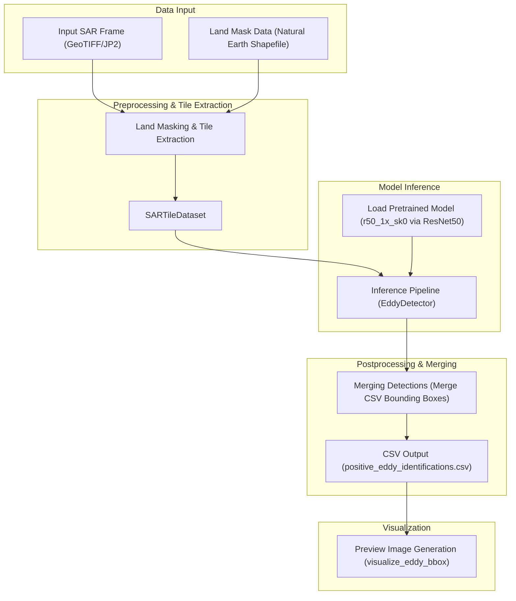

# SAR Eddy Detection Demo

Demonstration project for detecting ocean eddies from Synthetic Aperture Radar (SAR) imagery using a pretrained model (`r50_1x_sk0`). This demo processes SAR GeoTIFF files, identifies eddies, and generates visual output for further analysis.

## Table of Contents

- [Overview](#overview)
- [Quick Start](#quick-start)
- [Installation](#installation)
- [Directory Structure](#directory-structure)
- [Usage](#usage)
- [Outputs](#outputs)
<!-- - [Contributing](#contributing) -->
<!-- - [License](#license) -->



## Overview

This repository showcases how to use a pretrained ResNet-50-based model to detect ocean eddies from SAR imagery. The core functionality is implemented in [`src/main.py`](src/main.py), which loads the configuration, preprocesses input data, runs model inference, and generates output visualizations.

To keep the main README focused on the demo’s mechanics and results, detailed installation instructions and a full directory layout have been moved to separate Markdown files:
- See the [Installation Guide](INSTALLATION.md) for environment setup.
- Review the [Directory Structure Documentation](STRUCTURE.md) for a complete overview of the project layout.

## Quick Start

1. **Clone the repository.**
2. **Set up your environment** by following the [Installation Guide](INSTALLATION.md).
3. **Familiarize yourself with the project layout** in the [Directory Structure Documentation](STRUCTURE.md).
4. **Run the demo**:
   ```bash
   python src/main.py --config config/inference.yaml
   ```

## Installation

For full details on installation—including setting up with Conda or venv/pip and platform-specific notes—please refer to the [Installation Guide](INSTALLATION.md).

If you already have Conda on your system, you can do:

```bash
conda create --name sar_eddy_env python=3.10 pandas rasterio libgdal "geopandas>1.0.0" shapely tqdm pyyaml pytorch torchvision -c conda-forge
```

## Directory Structure

A well-organized repository makes it easy to locate files and understand project organization. For a complete breakdown of the directory layout, see the [Directory Structure Documentation](STRUCTURE.md).

## Usage

The demo workflow, executed by `src/main.py`, consists of these steps:
- **Configuration:** Loads settings from `config/inference.yaml`.
- **Preprocessing:** Uses `src/dataset.py` to handle and prepare SAR GeoTIFF files.
- **Inference:** Runs the pretrained model via `src/model.py` to detect eddies.
- **Visualization:** Generates and saves output visualizations using `src/visualize_eddy_bbox.py`.

To run the demo, execute:
```bash
python src/main.py --config config/inference.yaml
```
For more details on modifying the workflow, please check the inline comments in the source code.

## Outputs

After running the demo, expect the following outputs:
- **Visualizations:** Detected eddy bounding boxes and overlays saved in the `output/` directory.
- **Logs and Metrics:** Console output and log files that summarize the detection process and statistics.
- **Data Summaries:** Any generated metadata that provides insights into the detection results.

<!-- ## Contributing

Contributions to enhance the demo or extend its functionality are welcome. Please review our [Contributing Guidelines](CONTRIBUTING.md) for instructions on reporting issues, proposing improvements, and submitting pull requests. -->

<!-- ## License

This project is open source and available under the MIT License. See the [LICENSE](LICENSE) file for full details. -->
